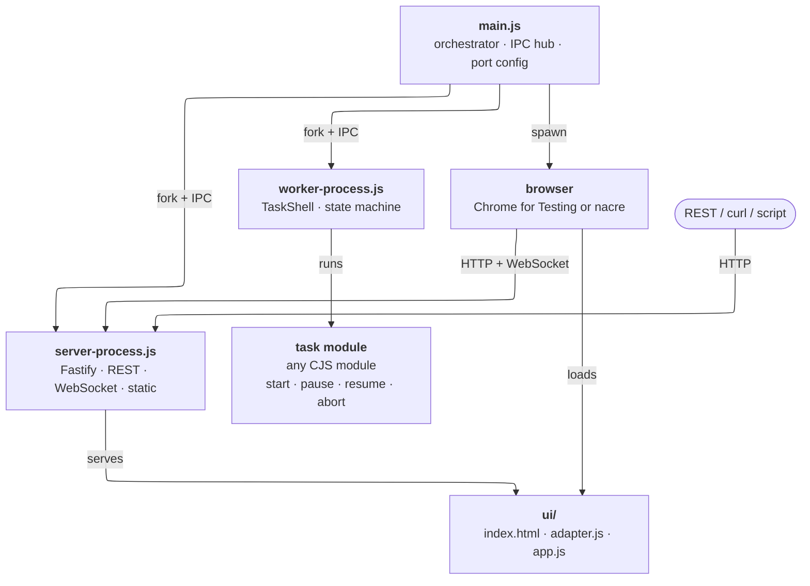

# task-primer

A resident Node.js application that delegates work to a managed subprocess and exposes control over it via REST API, WebSocket, and an optional browser UI. Intended as a **primer** — a clean, modular foundation to build real applications on top of.



```
main.js  (orchestrator)
├── worker/worker-process.js   fork — runs the task, owns the state machine
├── server/server-process.js   fork — Fastify: REST + WebSocket + static UI
└── browser                    spawn — Chrome for Testing  or  nacre
         ↕ IPC                          ↕ HTTP / WebSocket
    TaskShell + task module        ui/adapter.js + ui/app.js
```

---

## Quick start

```bash
npm install
node main.js                        # headless — ports auto-picked on first run
node main.js --ui                   # + download Chrome once, open app window
node main.js --ui --autoexit        # + exit when the window is closed
node main.js --worker-crash=restart # restart worker on unexpected crash
node pickPorts.js --override        # manually re-pick ports if they clash
```

---

## CLI flags

| Flag | Default | Description |
|------|---------|-------------|
| `--ui` | `false` | Launch the browser UI |
| `--autoexit` | `false` | Exit when the browser window closes (requires `--ui`) |
| `--worker-crash` | `report` | `report` or `restart` on unexpected worker exit |

---

## REST API

Base: `http://localhost:3000`

| Method | Path | Body | Description |
|--------|------|------|-------------|
| `GET`  | `/worker/status` | — | Worker state snapshot |
| `POST` | `/worker/assign` | `{ modulePath, config? }` | Load and start a task |
| `POST` | `/worker/pause`  | — | Pause running task |
| `POST` | `/worker/resume` | — | Resume paused task |
| `POST` | `/worker/abort`  | — | Abort immediately |
| `POST` | `/worker/reset`  | — | Return to `idle` after terminal state |
| `GET`  | `/config`        | — | Public app config (appName, etc.) |
| `GET`  | `/health`        | — | Liveness check |

Worker state shape:

```json
{ "state": "idle|running|paused|done|aborted|error", "message": "…", "percent": 0 }
```

Live state updates are also pushed over WebSocket at `ws://localhost:3000/ws/status`.

---

## Writing a task module

A task is any CJS module that exports an object with a `start(context)` method. `pause`, `resume`, and `abort` are optional.

```js
module.exports = {
  _paused: false,

  start(context) {
    // context.config           — passed from the /assign call
    // context.isCancelled()    — true after abort is requested
    // context.progress(pct, msg?)
    // context.done(result?)
    // context.fail(error)
    // context.ui               — native macOS UI API (see "nacre mode" below)

    let i = 0;
    const tick = () => {
      if (context.isCancelled()) return;
      if (this._paused) return void setTimeout(tick, 100);
      context.progress(++i, `step ${i}`);
      if (i >= 100) return context.done();
      setTimeout(tick, 50);
    };
    tick();
  },

  pause()  { this._paused = true; },
  resume() { this._paused = false; },
  abort()  { /* clear timers, close streams */ },
};
```

`modulePath` in the assign call is resolved relative to the project root.

---

## package.json configuration

All runtime configuration lives under `taskPrimer` in `package.json`. No config file is needed.

```json
"taskPrimer": {
  "appName":     "Task Primer",
  "appBundleId": null,
  "webPort":     6321,
  "webHost":     "127.0.0.1",

  "browser": {
    "product":    "chrome",
    "buildId":    "stable",
    "cacheDir":   ".browsers",
    "debugPort":  8120,
    "autoUpdate": false
  },

  "window": {
    "width": null, "height": null,
    "x":     null, "y":      null
  },

  "security": {
    "devTools":     true,
    "allowRefresh": true
  }
}
```

**`appName`** — window title and `<h1>` heading. In Chrome for Testing mode, also patches the `.app` bundle's `Info.plist` so the menu bar shows the correct name. In nacre mode this is set at bundle-assembly time; see the nacre documentation.

**`appBundleId`** — the macOS bundle identifier for the packaged application (e.g. `"com.example.myapp"`). Required in nacre mode (the orchestrator writes this); unused in Chrome for Testing mode.

**`webPort`** / **`webHost`** — port and bind address for the Fastify web server. `null` initially — auto-picked on first launch by `pickPorts.js`. Run `node pickPorts.js --override` to re-pick if a port gets claimed.

**`browser.product`** — `"chrome"` (default) uses Chrome for Testing; `"nacre"` switches to the nacre rendering path (see below). All other `browser.*` fields are ignored in nacre mode.

**`browser.buildId`** — `"stable"` resolves to the current Chrome for Testing stable release at download time. To pin a version use an exact string like `"124.0.6367.207"` — verified cross-platform builds are listed at https://googlechromelabs.github.io/chrome-for-testing/. Delete `.browsers/` to force a re-download.

**`browser.debugPort`** — Chrome's CDP remote debugging port, used internally for window-close detection, navigation guard injection, and target lifecycle management. `null` initially, auto-picked alongside `webPort`. Ignored in nacre mode.

**`browser.autoUpdate`** — when `false` (default), uses whatever Chrome for Testing build is in `.browsers/` and never contacts the network after the initial download. When `true`, checks for and downloads a newer build on each launch. Ignored in nacre mode.

**`window`** — initial window geometry in CSS pixels. `null` means the browser decides (Chrome remembers last position/size; nacre defaults to 80 % of the primary screen, centred). `x`/`y` positioning may be ignored by some Linux Wayland compositors.

**`security`** — all default to `true` (dev-friendly). Set to `false` for production:
- `devTools` — when `false`, the Web Inspector is disabled (nacre) or DevTools windows are closed via CDP as they open (Chrome).
- `allowRefresh` — when `false`, Cmd/Ctrl+R and F5 are suppressed in the page.

---

## Browser modes

### Chrome for Testing (default)

`--ui` downloads Chrome for Testing (~300 MB, once) into `.browsers/` and spawns it with `--app=<url>`, giving a frameless window with no address bar or tabs. A CDP connection is maintained for window-close detection, navigation guard injection, and target lifecycle management. See `browser/launcher.js` for the full details.

> **Secondary windows are not supported.** The CDP target lifecycle manager closes any window that is not the main app target — including those opened via `window.open()`. For UI that needs secondary "windows", use floating overlay panels within the single app window.

### nacre mode

Setting `browser.product = "nacre"` switches to [nacre](https://github.com/ciacob/nacre) — a lightweight native macOS shim that hosts the web content inside a `WKWebView` (system WebKit). This eliminates the ~300 MB Chrome download, gives the app a fully native macOS identity (name, icon, custom menu bar), and is the basis for distributable `.app` bundles.

In nacre mode:
- The nacre binary is spawned from a conventional path relative to the running executable: `../Resources/<appName>.app/Contents/MacOS/nacre`. No configuration is needed — the orchestrator places it there.
- Communication moves from CDP to a Unix socket protocol (`/tmp/<appBundleId>/menu.sock`). The socket is opened automatically; task modules interact with it through `context.ui` (see below).
- CDP is not used. Window-close detection, navigation guard injection, and DevTools toggling are all handled natively by nacre.

The orchestrator pipeline that packages a task-primer project into a nacre-based `.app` is described in the [nacre repository](https://github.com/ciacob/nacre).

---

## Native UI API (`context.ui`) — nacre mode only

When running in nacre mode, each task module receives a `context.ui` object for driving the native macOS menu bar and observing OS-level events. All methods are **no-ops in Chrome for Testing / npm mode** (they log a warning and return).

```js
// context.ui availability check
if (context.ui.isNacre) {
  context.ui.setMenu([ ... ]);
}
```

### Outbound — drive the native UI

```js
// Replace the entire menu bar
context.ui.setMenu([
  {
    label: 'File',
    items: [
      { id: 'file.export', label: 'Export…', key: 'e', modifiers: ['cmd'] },
      { type: 'separator' },
      { id: 'file.close',  label: 'Close',   key: 'w', modifiers: ['cmd'] },
    ],
  },
]);

// Update specific items without rebuilding the whole bar
context.ui.patchMenu([
  { id: 'file.export', enabled: false },
  { id: 'view.theme',  label: 'Dark Mode', checked: true },
]);

// Toggle the WebKit Web Inspector
context.ui.setDevTools(true);
```

Menu item descriptor fields: `id` (required), `label` (required), `key`, `modifiers` (`"cmd"`, `"shift"`, `"option"`, `"control"`), `enabled` (default `true`), `checked` (default `false`), `submenu` (array of items), `type: "separator"`.

Patch fields: `id` (required), `label`, `enabled`, `checked`.

### Inbound — observe native UI events

```js
// User activated a menu item
context.ui.onMenuAction((id) => {
  if (id === 'file.export') doExport();
});

// macOS delivered file-open requests (registered UTI, Finder, drag-to-Dock)
context.ui.onFileOpen((paths) => {
  paths.forEach((p) => openFile(p));
});

// User clicked the Dock icon while the app is already running
context.ui.onAppReopen(() => {
  // e.g. bring a panel back to front
});

// User closed the main window (red button)
// Note: --autoexit already handles process shutdown; this is for cleanup
context.ui.onWindowClosed(() => {
  saveState();
});
```

The full socket protocol (message shapes, socket path, all supported fields) is documented in the [nacre repository](https://github.com/ciacob/nacre).

---

## Seams — what to replace and where

| Seam | File | Replace to… |
|------|------|-------------|
| IPC message contract | `shared/messages.js` | Change transport or add message types |
| Worker state machine | `worker/task-shell.js` | Add queuing, retries, timeouts |
| Worker IPC harness | `worker/worker-process.js` | Swap to `worker_threads`, cluster |
| Task implementation | any module matching the interface | Your real work |
| Web server | `server/server-process.js` | Swap Fastify |
| REST routes | `server/routes/worker.js` | Add auth, versioning |
| WebSocket feed | `server/ws/status-feed.js` | Swap for SSE, socket.io |
| UI transport | `ui/adapter.js` | Change without touching rendering |
| UI rendering | `ui/app.js` + `ui/index.html` | React, Vue, Svelte, anything |
| Browser launcher | `browser/launcher.js` | nacre, Electron, system browser, headless |

---

## pkg compatibility

The project is CJS throughout. Three things need attention when bundling with `pkg`:

**Task modules** are loaded via a runtime-computed path, so `pkg`'s static analyser won't trace them automatically. Declare them explicitly as `pkg` assets in `package.json`:

```json
"pkg": {
  "assets": ["ui/**", "tasks/**"]
}
```

**Chrome for Testing binary** lives in `.browsers/` outside any bundle. When packaging, redirect `cacheDir` to sit next to the executable:
```js
const cacheDir = path.resolve(path.dirname(process.execPath), '.browsers');
```
In nacre mode there is no browser binary to manage — WebKit is provided by the OS.

**Static UI assets** — declare `ui/` as a `pkg` asset directory so `@fastify/static` can find the files at runtime.
